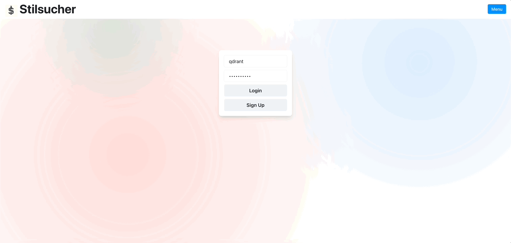
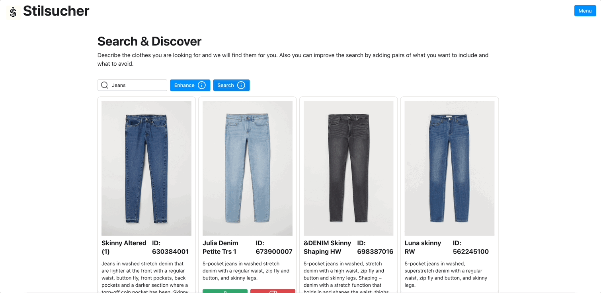
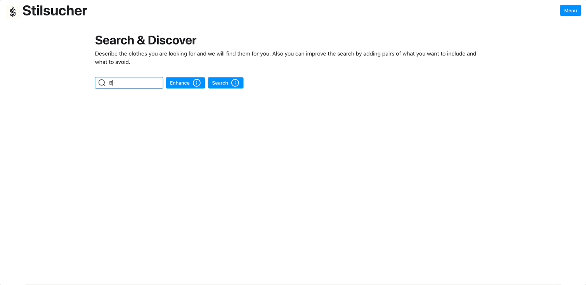

# Stilsucher
Fashion Semantic Search Engine. This project is a proof of concept for a Text2Image search engine for fashion items. It uses Fashion-CLIP to encode the text and images and Qdrant as a vector store to store and retrieve the embeddings.

The project is divided into two main parts:
- The Notebook Experiments: A set of notebooks used to prepare the dataset and evaluate the different retrieval strategies.
- The Web Application: A web application that allows the user to search for images using text queries and different retrieval strategies.

## Environment Setup

First of all, make sure you have Docker installed on your machine, since it is required to run Qdrant and the Application.

Then create a new virtual environment using the following command (or the equivalent depending on what solution you are using to create virtual environments):
```bash
python3 -m venv venv
```

### Using the setup script

After creating the virtual environment, activate it and run the following command to install and set up everything for the notebooks and the application to work:

```bash
bash setup.sh
```

This will install the required packages, build the application docker image, and download the dataset. After the script finishes running, you can start the application using the following command:

```bash
docker-compose up
```

If you want to run the notebooks, you can do it by running the following command:

```bash
jupyter lab
```

**Note**: If for some reason the Web Application is working very slowly, you can try to run the following command to rebuild the docker image:

```bash
docker-compose up qdrant -d
cd app
reflex run
```

## Experiments

The experiments are divided into the following notebooks:
- 01_embedding_creation.ipynb: This notebook is used to preprocess the dataset and create the embeddings for the images and the texts. It also explains how the positive and negative pairs are created for the discovery search and the recommendations API.
- 02_eval_retrieval_strategies.ipynb: This notebook is used to evaluate the different retrieval strategies using the embeddings created in the previous notebook. It also contains examples of queries that give the best and worst results for each strategy. Since we are only testing the retrieval strategies and we are not doing any type of re-ranking, the metric used to evaluate the results is Precision@k, where k is the number of retrieved items.

## System Overview

Stilsucher allows the user to search images in multiple ways using different retrieval strategies. There is already an admin user created with the following credentials:
- Username: admin
- Password: admin

The application is divided into the following sections:
- The Reflex Application: [http://localhost:3000](http://localhost:3000)
- The FastAPI Application: [http://localhost:8000](http://localhost:8000/docs)

### **Simple Text2Image search**: 

<!-- 01-simple-search.gif -->


Users provide a description for an item they are looking for. The application will use Fashion-CLIP to encode the query and will use the resulting vector to retrieve candidates from Qdrant.

### **Discovery Search**: 


This allows the user to improve their search by specifying positive and negative pairs of things they want to see in the results and things they want to avoid. The user can add as many pairs as they want, but more pairs will require more time and compute to retrieve the results. Something interesting about this API is that it helps overcome situations where the encoder is not able to encode semantic information like negations. In the example below, if we say "Blue Jeans, not black", the model will have a hard time trying to embed the negation, but by providing a positive and a negative pair, we can help the system to understand what we want to avoid.



### **Recommendations API**: 


Although designed for recommendation, this API can be used to retrieve similar items to a given image. Instead of specifying positive and negative pairs, the user can just provide as many positive and negative texts as they want to retrieve similar items. But again, more text samples will require more time and compute to retrieve the results.

### **Feedback**:


The system provides mechanisms to gather and store user feedback in a databse. By allowing users to provide feedback on the search results, the system can gather valuable information to improve and refine its retrieval strategies. This feedback can be used to retrain the models, fine-tune the indexing parameters, and enhance the overall performance of the system.

By incorporating user feedback into the machine learning flywheel, Stilsucher can be continuously improved based on user interactions and adapt to their preferences and needs. This iterative process helps to enhance the accuracy and relevance of the search results, providing a better user experience.

Overall, the machine learning flywheel enables Stilsucher to leverage user feedback as a valuable resource for continuous improvement, ensuring that the system evolves and becomes more effective over time. 

## Conclusions and Possible Improvements

On average, the best retrieval strategy was normal search, followed by the use of the recommendations API and the discovery search. But because we are doing ANN, the results might be affected by the way the index was created. More experiments could be done to evaluate the best way to create the index for this type of multimodal embeddings, like changing the number of edges per node and/or the number of neighbours to consider during the index building.  
Some clothes share the same description, that also affects the evaluation of the retrieval strategies. Also, the way the positive and negative pairs are created for the discovery search and the recommendations API could be improved. The current implementation is very simple and could be improved by using more complex strategies, like passing the items' categories to an LLM to generate more semantically meaningful pairs, instead of using the value of the category as it is.  
Lastly, ways to rerank the results could be explored, like training with `Quaternion` a model that concats text embedding with image embedding and outputs a score, similar to how cross-encoder transformers are used to rerank results in other search engines.


## Example Queries
This are some example queries that performed well and some that performed poorly for each retrieval strategy. Basically when doing the retrieval we used the product description, and if the product id was retrieved, it was considered a good query, otherwise it was considered a bad query.

```
When using Search with target
Some good queries were:
	 Two-strand hairband with braids in imitation suede and elastic at the back.

	 Cardigan in a bouclé knit made from a wool blend with a shawl collar, zip at one side and long sleeves.

	 Tights with an elasticated waist. 20 denier.

	 Jacket in sweatshirt fabric with a lined drawstring hood, zip down the front, side pockets and ribbing at the cuffs and hem.

	 Loafers in imitation suede with moccasin seams, decorative laces, fabric linings and insoles and rubber soles.

Some bad queries were:
	 Leggings in stretch jersey with an elasticated waist.

	 Tops in soft organic cotton jersey.

	 Short-sleeved top in jersey with sewn-in turn-ups on the sleeves.

	 Knee-length shorts in sweatshirt fabric with a low crotch, elasticated drawstring waist, side pockets, back pockets and ribbed hems.

	 Thin tights with an elasticated waist.

-----------------------
When using Search with enhanced_target
Some good queries were:
	 Two-strand hairband with braids in imitation suede and elastic at the back., It has to be Yellowish Brown, not Turquoise

	 Cardigan in a bouclé knit made from a wool blend with a shawl collar, zip at one side and long sleeves., It has to be Tops Knitwear DS, not Casual Lingerie

	 Tights with an elasticated waist. 20 denier., It has to be Socks and Tights, not Accessories

	 Jacket in sweatshirt fabric with a lined drawstring hood, zip down the front, side pockets and ribbing at the cuffs and hem., It has to be Jersey Basic, not Jewellery Extended

	 Loafers in imitation suede with moccasin seams, decorative laces, fabric linings and insoles and rubber soles., It has to be Brown, not Yellow

Some bad queries were:
	 Tops in soft organic cotton jersey., It has to be Light, not Dark

	 Short-sleeved top in jersey with sewn-in turn-ups on the sleeves., It has to be White, not Light Yellow

	 Knee-length shorts in sweatshirt fabric with a low crotch, elasticated drawstring waist, side pockets, back pockets and ribbed hems., It has to be Mole, not Pink

	 Fine-knit tights with an elasticated waist., It has to be Dusty Light, not Light

	 Fine-knit tights with an elasticated waist., It has to be Underwear Tights, not Hat/beanie

-----------------------
When using the Recommendations API
Some good queries were:
	target (positive):  Two-strand hairband with braids in imitation suede and elastic at the back.
	positive:  Yellowish Brown
	negative:  Turquoise

	target (positive):  Two-strand hairband with braids in imitation suede and elastic at the back.
	positive:  Accessories
	negative:  Shirts

	target (positive):  Gloves in soft, supple leather. Lined.
	positive:  Brown
	negative:  Pink

	target (positive):  Tights with an elasticated waist. 20 denier.
	positive:  Socks and Tights
	negative:  Accessories

	target (positive):  Loafers in imitation suede with moccasin seams, decorative laces, fabric linings and insoles and rubber soles.
	positive:  Brown
	negative:  Yellow

Some bad queries were:
	target (positive):  Tops in soft organic cotton jersey.
	positive:  Light
	negative:  Dark

	target (positive):  Short-sleeved top in jersey with sewn-in turn-ups on the sleeves.
	positive:  White
	negative:  Light Yellow

	target (positive):  All-in-one pyjamas in soft, organic cotton jersey with short sleeves, short legs and press-stud fastenings.
	positive:  Under-, Nightwear
	negative:  Socks and Tights

	target (positive):  Fine-knit tights with an elasticated waist.
	positive:  Dusty Light
	negative:  Light

	target (positive):  Fine-knit tights with an elasticated waist.
	positive:  Underwear Tights
	negative:  Hat/beanie

-----------------------
When using the Recommendations API
Some good queries were:
	target (positive):  Two-strand hairband with braids in imitation suede and elastic at the back.
	positive:  Yellowish Brown
	negative:  Turquoise

	target (positive):  Cardigan in a bouclé knit made from a wool blend with a shawl collar, zip at one side and long sleeves.
	positive:  Tops Knitwear DS
	negative:  Casual Lingerie

	target (positive):  Tights with an elasticated waist. 20 denier.
	positive:  Socks and Tights
	negative:  Accessories

	target (positive):  Jacket in sweatshirt fabric with a lined drawstring hood, zip down the front, side pockets and ribbing at the cuffs and hem.
	positive:  Jersey Basic
	negative:  Jewellery Extended

	target (positive):  Loafers in imitation suede with moccasin seams, decorative laces, fabric linings and insoles and rubber soles.
	positive:  Brown
	negative:  Yellow

Some bad queries were:
	target (positive):  Leggings in stretch jersey with an elasticated waist.
	positive:  Green
	negative:  Black

	target (positive):  Tops in soft organic cotton jersey.
	positive:  Light
	negative:  Dark

	target (positive):  Short-sleeved top in jersey with sewn-in turn-ups on the sleeves.
	positive:  White
	negative:  Light Yellow

	target (positive):  Knee-length shorts in sweatshirt fabric with a low crotch, elasticated drawstring waist, side pockets, back pockets and ribbed hems.
	positive:  Mole
	negative:  Pink

	target (positive):  Fine-knit tights with an elasticated waist.
	positive:  Dusty Light
	negative:  Light

-----------------------
When using the Discovery API
Some good queries were:
	target:  Two-strand hairband with braids in imitation suede and elastic at the back.
	positive:  Yellowish Brown
	negative:  Turquoise

	target:  Cardigan in a bouclé knit made from a wool blend with a shawl collar, zip at one side and long sleeves.
	positive:  Tops Knitwear DS
	negative:  Casual Lingerie

	target:  Tights with an elasticated waist. 20 denier.
	positive:  Socks and Tights
	negative:  Accessories

	target:  Jacket in sweatshirt fabric with a lined drawstring hood, zip down the front, side pockets and ribbing at the cuffs and hem.
	positive:  Jersey Basic
	negative:  Jewellery Extended

	target:  Loafers in imitation suede with moccasin seams, decorative laces, fabric linings and insoles and rubber soles.
	positive:  Brown
	negative:  Yellow

Some bad queries were:
	target Tops in soft organic cotton jersey.
	positive:  Light
	negative:  Dark

	target Short-sleeved top in jersey with sewn-in turn-ups on the sleeves.
	positive:  White
	negative:  Light Yellow

	target Short-sleeved polo shirt in organic cotton jersey with a ribbed collar and button placket.
	positive:  Medium
	negative:  Dark

	target Fine-knit tights with an elasticated waist.
	positive:  Dusty Light
	negative:  Light

	target Fine-knit tights with an elasticated waist.
	positive:  Underwear Tights
	negative:  Hat/beanie
```